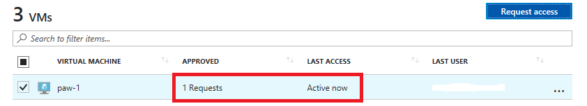
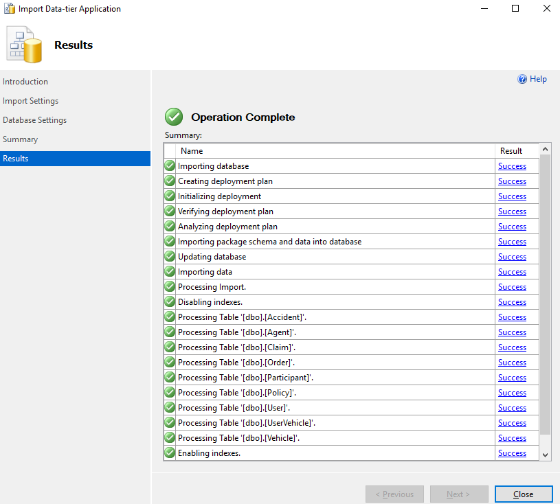
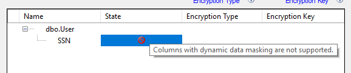
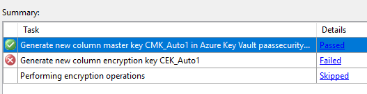
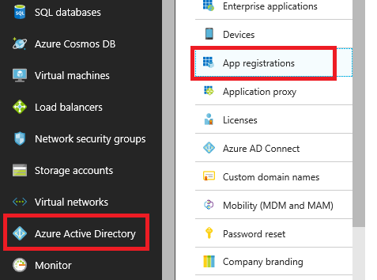
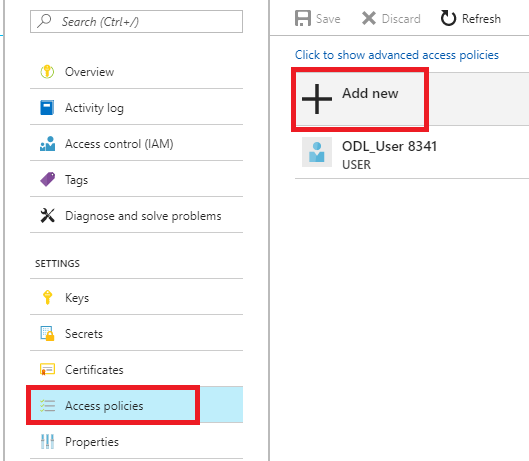
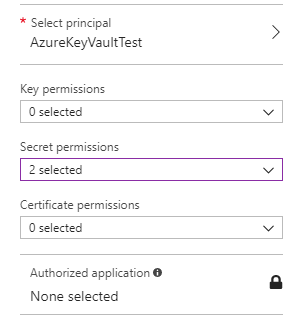
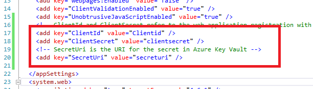
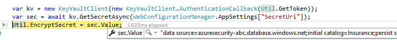
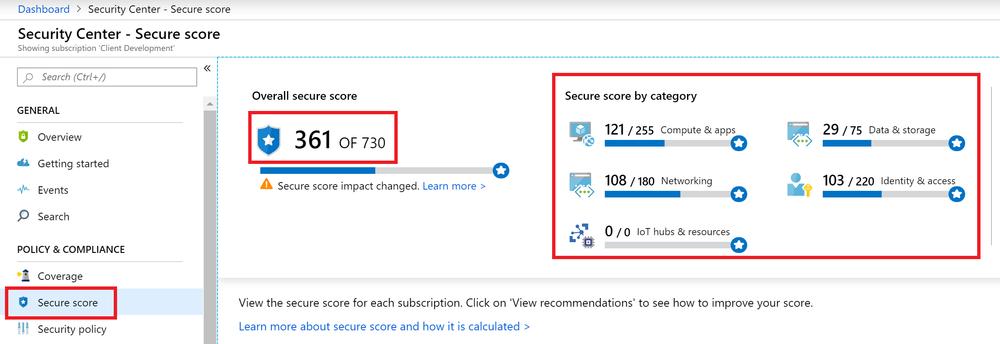

<div class="MCWHeader1">
Security baseline on Azure
</div>

<div class="MCWHeader2">
Hands-on lab step-by-step
</div>

<div class="MCWHeader3">
March 2019
</div>

Information in this document, including URL and other Internet Web site references, is subject to change without notice. Unless otherwise noted, the example companies, organizations, products, domain names, e-mail addresses, logos, people, places, and events depicted herein are fictitious, and no association with any real company, organization, product, domain name, e-mail address, logo, person, place or event is intended or should be inferred. Complying with all applicable copyright laws is the responsibility of the user. Without limiting the rights under copyright, no part of this document may be reproduced, stored in or introduced into a retrieval system, or transmitted in any form or by any means (electronic, mechanical, photocopying, recording, or otherwise), or for any purpose, without the express written permission of Microsoft Corporation.

Microsoft may have patents, patent applications, trademarks, copyrights, or other intellectual property rights covering subject matter in this document. Except as expressly provided in any written license agreement from Microsoft, the furnishing of this document does not give you any license to these patents, trademarks, copyrights, or other intellectual property.

The names of manufacturers, products, or URLs are provided for informational purposes only, and Microsoft makes no representations and warranties, either expressed, implied, or statutory, regarding these manufacturers or the use of the products with any Microsoft technologies. The inclusion of a manufacturer or product does not imply endorsement of Microsoft of the manufacturer or product. Links may be provided to third-party sites. Such sites are not under the control of Microsoft and Microsoft is not responsible for the contents of any linked site or any link contained in a linked site, or any changes or updates to such sites. Microsoft is not responsible for webcasting or any other form of transmission received from any linked site. Microsoft is providing these links to you only as a convenience, and the inclusion of any link does not imply endorsement of Microsoft of the site or the products contained therein.

© 2019 Microsoft Corporation. All rights reserved.

Microsoft and the trademarks listed at <https://www.microsoft.com/en-us/legal/intellectualproperty/Trademarks/Usage/General.aspx> are trademarks of the Microsoft group of companies. All other trademarks are the property of their respective owners.

**Contents**

<!-- TOC -->

- [Security baseline on Azure hands-on lab step-by-step](#security-baseline-on-azure-hands-on-lab-step-by-step)
    - [Abstract and learning objectives](#abstract-and-learning-objectives)
    - [Overview](#overview)
    - [Solution architecture](#solution-architecture)
    - [Requirements](#requirements)
    - [Exercise 1: Implementing Just-In-Time (JIT) access](#exercise-1-implementing-just-in-time-jit-access)
        - [Task 1: Setup virtual machine with JIT](#task-1-setup-virtual-machine-with-jit)
        - [Task 2: Perform a JIT request](#task-2-perform-a-jit-request)
    - [Exercise 2: Securing the Web Application and database](#exercise-2-securing-the-web-application-and-database)
        - [Task 1: Setup the database](#task-1-setup-the-database)
        - [Task 2: Test the web application solution](#task-2-test-the-web-application-solution)
        - [Task 3: Utilize data masking](#task-3-utilize-data-masking)
        - [Task 4: Utilize column encryption with Azure Key Vault](#task-4-utilize-column-encryption-with-azure-key-vault)
    - [Exercise 3: Migrating to Azure Key Vault](#exercise-3-migrating-to-azure-key-vault)
        - [Task 1: Create an Azure Key Vault secret](#task-1-create-an-azure-key-vault-secret)
        - [Task 2: Create an Azure Active Directory application](#task-2-create-an-azure-active-directory-application)
        - [Task 3: Assign Azure Active Directory application permissions](#task-3-assign-azure-active-directory-application-permissions)
        - [Task 4: Install or verify NuGet Package](#task-4-install-or-verify-nuget-package)
        - [Task 5: Test the solution](#task-5-test-the-solution)
    - [Exercise 4: Securing the network](#exercise-4-securing-the-network)
        - [Task 1: Test network security group rules \#1](#task-1-test-network-security-group-rules-\1)
        - [Task 2: Configure network security groups](#task-2-configure-network-security-groups)
        - [Task 3: Test network security group rules \#2](#task-3-test-network-security-group-rules-\2)
        - [Task 4: Install network watcher VM extension](#task-4-install-network-watcher-vm-extension)
        - [Task 5: Setup network packet capture](#task-5-setup-network-packet-capture)
        - [Task 6: Execute a port scan](#task-6-execute-a-port-scan)
    - [Exercise 5: Azure Sentinel logging and reporting](#exercise-5-azure-sentinel-logging-and-reporting)
        - [Task 1: Create a Dashboard](#task-1-create-a-dashboard)
        - [Task 2: Create an Analytics alert](#task-2-create-an-analytics-alert)
        - [Task 3: Investigate a custom alert case](#task-3-investigate-a-custom-alert-case)
        - [Task 4: Create and run a playbook](#task-4-create-and-run-a-playbook)
        - [Task 5: Execute Jupyter Notebooks](#task-5-execute-jupyter-notebooks)
        - [Task 6: Creating Reports with Power BI](#task-6-creating-reports-with-power-bi)
    - [Exercise 6: Using Compliance Tools (Azure Policy, Secure Score and Compliance Manager)](#exercise-6-using-compliance-manager)
        - [Task 1: Review a basic Azure Policy](#task-1-review-a-basic-azure-policy)
        - [Task 2: Review and create Azure Blueprints](#task-2-review-and-create-azure-blueprint)
        - [Task 3: Secure Score](#task-3-secure-score)
        - [Task 4: Use Compliance Manager for Azure](#task-4-use-compliance-manager-for-azure)
    - [After the hands-on lab](#after-the-hands-on-lab)
        - [Task 1: Delete resource group](#task-1-delete-resource-group)
        - [Task 2: Remove Standard Tier Pricing](#task-2-remove-standard-tier-pricing)
        - [Task 3: Delete lab environment (optional)](#task-3-delete-lab-environment-optional)
    - [Appendix A](#appendix-a)
        - [Task 1: Create storage account](#task-1-create-storage-account)
        - [Task 2: Create virtual networks](#task-2-create-virtual-networks)
        - [Task 3: Create virtual machines](#task-3-create-virtual-machines)
        - [Task 4: Create network security groups](#task-4-create-network-security-groups)
        - [Task 5: Azure SQL server](#task-5-azure-sql-server)
        - [Task 6: Create an Azure key vault](#task-6-create-an-azure-key-vault)

<!-- /TOC -->

# Security baseline on Azure hands-on lab step-by-step 

## Abstract and learning objectives 

In this hands-on lab, you will implement many of the Azure Security Center features to secure their cloud-based Azure infrastructure (IaaS) and applications (PaaS). Specifically, you will ensure that any internet exposed resources have been properly secured and any non-required internet access disabled. Additionally, you will implement a “jump machine” for administrators with Application Security enabled to prevent those same administrators from installing non-approved software and potentially exposing cloud resources. You will then utilize custom alerts to monitor for TCP/IP Port Scans to fire alerts.

At the end of this hands-on lab, you will be better able to design and build secure cloud-based architectures, and to improve the security of existing applications hosted within Azure.

## Overview

Contoso is a multinational corporation, headquartered in the United States that provides insurance solutions worldwide. Its products include accident and health insurance, life insurance, travel, home, and auto coverage. Contoso manages data collection services by sending mobile agents directly to the insured to gather information as part of the data collection process for claims from an insured individual. These mobile agents are based all over the world and are residents of the region in which they work. Mobile agents are managed remotely, and each regional corporate office has a support staff responsible for scheduling their time based on requests that arrive to the system.

They are migrating many of their applications via Lift and Shift to Azure and would like to ensure that they can implement the same type of security controls and mechanisms they currently have. They would like to be able to demonstrate their ability to meet compliance guidelines required in the various countries/regions they do business. They have already migrated a web application and database server to their Azure instance and would like to enable various logging and security best practices for administrator logins, SQL Databases, and virtual network design.

## Solution architecture

Contoso administrators recently learned about the Azure Security Center and have decided to implement many of its features to secure their cloud-based Azure infrastructure (IaaS) and applications (PaaS). Specifically, they want to ensure that any internet exposed resources have been property secured and any non-required internet access disabled. They also decided that implementing a "jump machine" for admins with Application Security was also important as they have had instances of admins installing non-approved software on their machines and then accessing cloud resources. Additionally, they want the ability to be alerted when TCP/IP Port Scans are detected, and fire alerts based on those attacks.


The solution begins by creating a jump machine. This jump machine is used to access the virtual machines and other resources in the resource group. All other access is disabled via multiple **virtual networks**. More than one virtual network is required as having a single **virtual network** would cause all resource to be accessible based on the default currently un-customizable security group rules. Resources are organized into these virtual networks. **Azure Center Security** is utilized to do **Just-In-Time** access to the jump machine. This ensures that all access is audited to the jump machine and that only authorized IP-addressed are allowed access, this prevents random attacks on the virtual machines from bad internet actors. Additionally, applications are not allowed to be installed on the jump machine to ensure that malware never becomes an issue. Each of the virtual network and corresponding **network security groups** have logging enabled to record deny events to **Azure Logging**. These events are then monitored by a **custom alert rule** in **Azure Sentinel** to fire **custom alerts**. Once the solution is in place, the **Compliance Manager** tool is utilized to ensure that all GDPR based technical and business controls are implemented and maintained to ensure GDPR compliance.

## Requirements

1. Microsoft Azure subscription must be pay-as-you-go or MSDN.

    - Trial subscriptions will not work.
    
2. A machine with the following software installed:

    - Visual Studio 2017
    - SQL Management Studio 2017
    - Power BI Desktop

## Exercise 1: Implementing Just-In-Time (JIT) access

Duration: 15 minutes

Synopsis: In this exercise, attendees will secure a Privileged Access Workstation (PAW) workstation using the Azure Security Center Just In Time Access feature.

### Task 1: Setup virtual machine with JIT

1.  In a browser, navigate to your Azure portal (<https://portal.azure.com>).

2.  Select **Security Center,** then select **Just in time VM access**.

    

> **Note**: Your subscription may not be set up with the **Standard** tier; if that is the case then do the following:

   a.  In the **Security Center** blade, select **Security Policy**.

   b.  For your subscription, select **Edit settings**

   c.  Select **Pricing Tier**

   d.  Select **Standard**

   e.  Click **Save**

   f.  Navigate back to Security Center, select **Just in time VM access**.

3.  Select the **Recommended** tab, and then check the checkbox to select the lab vms (db-1, paw-1 and web-1), and then select the **Enable JIT on 3 VMs** link.

> **Note**: It could take up to 10 minutes for new VMs to show up if you upgraded to standard tier security.  Also note that it is possible new VMs display in the **No recommendation** tab until a backend process moves them to the **Recommended** tab.

4.  In the configuration window that opens, review the settings, then select **Save**.

    

5.  You should now see the states change to **Resolved**.  

> **Note**: It could take a couple minute for this to revert to the resolved state.
    
   

### Task 2: Perform a JIT request

1.  Select the **Configured** tab. You should now see all the machines listed.

2.  Select the **paw-1** virtual machine, and then select **Request access**.

    

3.  For each of the ports, select the **On** toggle button, notice how the default IP settings is **My IP**.

    

4.  At the bottom of the dialog, select **Open ports**. After a few moments, you should now see the **APPROVED** requests have been incremented and the **LAST ACCESS** is set to **Active now.**.

    

5.  Select the ellipses, then select **Activity Log**, you will be able to see a history of who requests access to the virtual machines.

    

6.  In the Azure Portal main menu, select **All Services**, then type **Network**, then select **Network Security Group**:


7.  Select the **paw-1-nsg** network security group.

8.  Select **Inbound security rules.** You should now see a set of inbound security rules set up by JIT Access.

    

## Exercise 2: Securing the Web Application and database

Duration: 45 minutes

Synopsis: In this exercise, attendees will utilize Azure SQL features to data mask database data and utilize Azure Key Vault to encrypt sensitive columns for users and applications that query the database.

### Task 1: Setup the database

1.  Switch to your Azure portal, select **All Services** then search for **SQL Servers**.  Select **SQL Servers**:

    

2.  Select the **Azure SQL** database server you created using the Azure Manager template (Ex:  AzureSecurity-INIT).

3.  Select **SQL Databases**, then select the **SampleDB** database.

    

4.  In the summary section, select the **Show database connection strings**.

    

5.  Take note of the connection string for later in this lab, specifically the **Server** parameter:

    

6.  Open **SQL Server Management Studio**.

7.  Enter the database server name from above.

8.  Enter the username and password used from the Azure Template deployment (**wsadmin** - **p\@ssword1rocks**).

    > **Note**: If you changed the username and password in the ARM template deployment, use those values instead.

    

9.  Select **Connect**, in the **New Firewall Rule** dialog, select **Sign In**.

10. Sign in with your resource group owner credentials.

11. In the dialog, select **OK**, notice how your IP address will be added for connection.

    

12. Right-click **Databases**, and select **Import Data-tier Application**.

    

13. In the Introduction dialog, select **Next**.

14. Select **Browse**, navigate to the extracted **Database** directory, and select the **Insurance.bacpac** file.

    

15. Select **Open**.

16. On the **Import Settings** dialog, select **Next**.

17. On the **Database Settings** dialog, select **Next**.

> **Note**: If you get an error, close and re-open SQL Management Studio try the import again. If that does not work, you may need to download the latest SQL Management Studio from [here](https://docs.microsoft.com/en-us/sql/ssms/download-sql-server-management-studio-ssms?view=sql-server-2017). In some instances, the latest version may not work, version 17.3 is known to deploy the package properly.  You should also be aware that bacpac files exported from some SQL Server instances cannot be deployed to Azure SQL Servers.  We have also included a .bak file of the Insurance database that you can use to restore from.

18. Select **Finish** and the database will deploy to Azure.

19. Once completed, select **Close**.

    

20. In **SQL Management Studio**, select **File-\>Open-\>File**.

    

21. Browse to the extracted GitHub folder, select the **\\Hands-on lab\\Database\\00\_CreateLogin.ps1** file.

22. Ensure that the **master** database is selected.

23. Run the script to create a login called **agent**.

24. Browse to the extracted folder, select the **\\Hands-on lab\\Database\\01\_CreateUser.ps1** file.

25. Ensure that the **Insurance** database is selected.

26. Run the script to create a non-admin user called **agent**.

### Task 2: Test the web application solution

1.  In the extracted directory, double-click the **/WebApp/InsuranceAPI/InsuranceAPI.sln** solution file, and Visual Studio will open.

2.  In the **Solution Explorer**, navigate to and double-click the **web.config** file to open it.

    

3.  Update the web.config (line 72) to point to the **Insurance** database created in Task 2. You should only need to update the server name to point to your Azure SQL Server.

    

4.  Run the **InsuranceAPI** solution and press **F5**.

5.  In the browser window that opens, browse to [http://localhost:portno/api/Users/E91019DA-26C8-B201-1385-0011F6C365E9](http://localhost:portno/api/Users/E91019DA-26C8-B201-1385-0011F6C365E9) you should see a json response that shows an unmasked SSN column.

> **Note**: Depending on your browser, you may need to download to view the json response.

   

### Task 3: Utilize data masking

1.  Switch to the Azure Portal.

2.  Select **SQL databases**.

3.  Select the **Insurance** database.

4.  In the menu, select **Dynamic Data Masking**, then select **+Add Mask**.

    

5.  Select the **User** table.

6.  Select the **SSN** column.

7.  Select **Add**.

    

8.  Select **Save**.

9.  Switch back to your InsuranceAPI solution, press **F5** to refresh the page. You should see the SSN column is now masked with **xxxx**.

    

10. Close **Visual Studio**.

### Task 4: Utilize column encryption with Azure Key Vault

1.  Switch to **SQL Management Studio**.

2.  In the extracted directory, navigate to the **Database** directory.

3.  Open the **02\_PermissionSetup.sql** file, copy and paste the TSQL to the Query Window.

4.  Switch to the **Insurance** database, and execute the SQL statement.

5.  In the **Object Explorer**, expand the **Insurance** node.

6.  Expand the **Tables** node.

7.  Expand the **User** table node.

8.  Expand the **Columns** node.

9.  Right-click the **SSN** column, and select **Encrypt Column**.

    

    Notice that the State of the column is such that you cannot add encryption (data masking):

    

10. Select **Cancel**.

11. Switch back to the Azure Portal, and select the User.SSN data masking.

12. Select **Delete**.

    

13. Select **Save**.

14. Switch back to **SQL Management Studio**.

15. Right-click the **SSN** column, and select **Encrypt Column**.

16. Check the checkbox next to the **SSN** column.

17. For the **Encryption Type**, and select **Deterministic**.

    

18. Select **Next**.

19. For the encryption select **Azure Key Vault** in the dialog.

    

20. Select **SignIn**.

21. Sign in with your Azure Portal credentials.

22. Select your Azure Key Vault.

23. Select **Next**.

24. On the **Run Settings**, select **Next**.

25. Select **Finish**, and the configured will start.

    > **Note**: You may receive a "wrapKey" error. If so, ensure that your account has been assigned those permissions in the Azure Key Vault.

    

    a.  Select **Key vault**.

    b.  Select your key vault.

    c.  Select **Access policies**.

    d.  Select **Add New**.

    e.  For the principal, select your account.

    f.  Select **Key permissions**, and select **Select all**.

    

    g.  Select **Secret permissions**, and select **Select all**.

    h.  Select **Certificate permissions**, and select **Select all**.

    i.  Select **OK**.

    j.  Select **Save**.

    k.  Retry the operation.

    > **Note**: If you are still getting errors (such as Access Denied), ensure that you have selected the correct subscription and Key Vault.

    

<!-- -->

26. Select **Close**.

27. Right-click the **User** table, and select **Select top 1000 rows**.

    

    You will notice the SSN column is encrypted based on the new Azure Key Vault key.

    

28. Switch to the Azure Portal.

29. Select **Key Vaults**.

30. Select your Azure Key Vault, and then select **Keys**. You should see the key created from the SQL Management Studio displayed:

    

## Exercise 3: Migrating to Azure Key Vault

Duration: 30 minutes

Synopsis: In this exercise, attendees will learn how to migrate web application to utilize Azure Key Vault rather than storing valuable credentials (such as connection strings) in application configuration files.

### Task 1: Create an Azure Key Vault secret

1.  From the extracted GitHub directory, open the **\\Hands-on lab\\WebApp\\InsuranceAPI\_KeyVault\\InsuranceAPI.sln** solution.

>**Note**:  Be sure you open the correct solution (there are two).

2.  Switch to your Azure Portal.

3.  Select **Key Vaults**, then select your Azure Key Vault.

    

4.  Select **Secrets**, then select **+Generate/Import**.

    

5.  For the **Upload Options**, select **Manual**.

6.  For the **Name**, enter **InsuranceAPI**.

7.  For the **Value,** copy the connection string information from the InsuranceAPI solution web.config file in Exercise 2.

8.  Select **Create**.

9.  Select **Secrets**.

10. Select **InsuranceAPI**.

11. Select the current version.

    

12. Copy and record the secret identifier URL for later use:

    

### Task 2: Create an Azure Active Directory application

1.  In the Azure Portal, select **Azure Active Directory**, then select **App Registrations**.

    

2.  Select **+** **New application registration**.

3.  For the name, type **AzureKeyVaultTest**.

4.  For the Sign-on URL, type <http://localhost:12345>.

    

5.  Select **Create**.

6.  Select the new **AzureKeyVaultTest** application.

7.  Copy and record the **Application ID** for later use.

    

8.  Select **Settings**.

9. Select **Keys**.

10. For the description, enter **InsuranceAPI**.

11. For the Expires, select **In 1 year**.

12. Select **Save**.

13. Copy and record the key value for later use.

### Task 3: Assign Azure Active Directory application permissions

1.  Switch back to Azure Portal and select your Azure Key Vault.

2.  Select **Access Policies**.

3.  Select **+ Add New**.

    

4.  Select **Select principal**, type **AzureKeyVaultTest**.

5.  Select the application service principal, select **Select**.

6.  Select the **Secret permissions** drop-down, check the **Get** and **List** permissions.

    

7.  Select **OK**.

8.  Select **Save**.

### Task 4: Install or verify NuGet Package

1.  Switch to **Visual Studio**.

2.  In the menu, select **View-\>Other Windows-\>Package Manager Console**.

3.  In the new window that opens, run the following commands:

    a.  Install-Package Microsoft.CodeDom.Providers.DotNetCompilerPlatform

    b.  Install-Package Microsoft.IdentityModel.Clients.ActiveDirectory -Version 2.16.204221202

    c.  Install-Package Microsoft.Azure.KeyVault

> **Note**: These already exist in the project but are provided as a reference.

4.  From **Solution Explorer**, double-click the **web.config** file to open it.

    Notice the **appSettings** section has some token values:

    

5.  Replace the **ClientId** and **ClientSecret** with the values from Task 2.

6.  Replace the **SecretUri** with the Azure Key Vault secret key Uri from Task 1.

7.  Save the file.

### Task 5: Test the solution

1.  Open the **web.config**, and comment out or delete the **connectionString** from the file at line 78.

2.  Open the **global.asax.cs** file, and place a break point at line 28.

> **Note**: This code makes a call to get an accessToken as the application you set up above, then make a call to the Azure Key Vault using that accessToken.

3.  Run the solution, and press **F5**.

    You should see that you execute a call to Azure Key Vault and get back the secret (which in this case is the connection string to the Azure Database).

    

4.  Press **F5**, and navigate to [http://localhost:portno/api/Users](http://localhost:portno/api/Users), you should get an error. Because you encrypted the column in the previous exercise, EntityFramework is not able to retrieve the value. You would need to add the [AzureKeyVaultProvider for Entity Framework](https://blogs.msdn.microsoft.com/sqlsecurity/2015/11/10/using-the-azure-key-vault-key-store-provider-for-always-encrypted/) reference to the project and then register the provider code in order for .NET to handle the encrypted column and add the "Column Encryption Setting=Enabled" to the connection string.

## Exercise 4: Securing the network

Duration: 45 minutes

Synopsis: In this exercise, attendees will utilize Network Security Groups to ensure that virtual machines are segregated from other Azure hosted services and then explore the usage of the Network Packet Capture feature of Azure to actively monitor traffic between networks.

### Task 1: Test network security group rules \#1

1.  In the Azure Portal, select **Virtual Machines**.

2.  Select **paw-1**, then select **Connect**.  In the dialog, select **Download RDP file Anyway**.  Open the downloaded RDP file and connect to the Virtual Machine.

    > **Note**: Default username is **wsadmin** with **p\@ssword1rocks** as password and you may need to request JIT Access if you have taken a break between exercises.

3.  In the **PAW-1** virtual machine, open **PowerShell ISE as administrator**.

4.  Run the following command:

```PowerShell
Set-ExecutionPolicy -ExecutionPolicy Unrestricted
```

5.  In the popup, click **Yes**.

6.  Select File-\>Open, browse to the extracted GitHub directory and open the **\\Hands-on lab\\Scripts \\PortScanner.ps1**.

    > **Note**: You would have downloaded the [GitHub repo](https://github.com/Microsoft/MCW-Azure-Security-Privacy-and-Compliance) and extracted this in the setup steps.  If you did not perform those steps, perform them now. You can also choose to copy the file from your desktop to the VM.

7.  Review the script. It does the following:

    a.  Installs NotePad++

    b.  Adds hosts entries for DNS

    > **Note**: When using multiple virtual networks, you must setup a DNS server in the Azure tenant.

    c.  Executes port scans

8.  Run the script, and press **F5.** You should see the following (the Azure ARM Template created a default rule to block all traffic):

    a.  Port scan for port 3389 (RDP) to **DB-1** and **WEB-1** is unsuccessful from the **PAW-1** machine.

    b.  The information above for port 3389 (RDP) is visible after running the script and pressing **F5**.
    
    

    c.  Port scan for port 1433 (SQL) to **DB-1** and **WEB-1** is unsuccessful from the **PAW-1** machine. **DB-1** is running SQL Server but traffic is blocked at NSG and via the Windows Firewall.

    

    d.  Port scan for port 80 (HTTP) to **DB-1** and **WEB-1** is unsuccessful from the **PAW-1** machine, if traffic was allowed, it would always fail to **DB-1** because it is not running IIS or any other web server.

    

### Task 2: Configure network security groups

1.  Switch to the Azure Portal.

2.  Configure the database server to only allow SQL Connections from the web server:

    a.  Select **Network Security Groups**.

    b.  Select **DbTrafficOnly**.

    c.  Select **Inbound Security Rules**.

    d.  Select **+Add**.

    e.  For the **Source**, select **IP Addresses**.

    f.  For the **Source IP address**, enter **10.2.0.4**.

    g.  For the **Destination port range**, enter **1433**.

    h.  For the **Priority**, enter **100**.

    i.  For the **Name**, enter **Port_1433**.

    g.  Select **Add**.

3.  Configure the web server to allow all HTTP and HTTPS connections:

    a.  Select **Network Security Groups**.

    b.  Select **WebTrafficOnly**.

    c.  Select **Inbound Security Rules**.

    d.  Select **+Add**.

    e.  For the **Destination port range**, enter **80,443**.

    f.  For the **Priority**, enter **100**.

    g.  Change the **Name** to **Port\_80\_443**.

    h.  Select **Add**.

    > **Note**: In some rare cases it may take up to 15 minutes for your Network Security Group to change is status from **Updating**.  You won't be able to add any other rules until it completes.

4.  Configure both the database and web server to only allow RDP connections from the PAW machine:

    a.  Select **Network Security Groups.** For both the **DbTrafficOnly** and **WebTrafficOnly**, do the following:
    
       -  Select **Inbound Security Rules**.

       -  Select **+Add**.

       -  For the **Source**, select **IP Addresses**.

       -  For the **Source IP address**, enter **10.0.0.4**.

       -  For the **Destination port range**, enter **3389**.

       -  For the **Priority**, enter **101**.

       -  For the **Name**, enter **Port_3389**.

       -  Select **Add**.

5.  Configure all NSGs to have Diagnostic logs enabled.

    a.  Select **Network security groups.** For each NSG (DBTrafficOnly and WebTrafficOnly), do the following:

       -  In the content menu, select **Diagnostic logs**, and then select **Turn on diagnostics**.

       

       -  For the name, enter the NSG name and then add **Logging** to the end.

       -  Check the **Send to Log Analytics** checkbox, in the **Log Analytics** box, select **Configure**.
       
       -  Select the **azsecuritylogging** workspace.
       
       -  Select both LOG checkboxes.

       -  Select **Save**.

       

       -  Repeat for all remaining Network Security Groups

### Task 3: Test network security group rules \#2

1.  Switch back to the **PAW-1** virtual machine.

2.  Run the script, press **F5**, and you should see the following:

    a.  Port scan for port 3389 (RDP) to **DB-1** and **WEB-1** is successful from the **PAW-1** machine.

    

    b.  Port scan for port 1433 (SQL) to **DB-1** is successful, and **WEB-1** is unsuccessful from the **PAW-1** machine.

> **Note**: You may need to disable the windows firewall on the DB-1 server to achieve this result.

   

   c.  If IIS has been setup on WEB-1, the port scan for port 80 (HTTP) to **DB-1** is unsuccessful and **WEB-1** is successful from the **PAW-1** machine

   

### Task 4: Install network watcher VM extension

1.  Switch to the Azure Portal.

2.  Select **Virtual Machines**.

3.  Select **db-1**.

4.  In the blade menu, select **Extensions**, then select **+Add**.

    

5.  Browse to the **Network Watcher Agent for Windows**, and select it.

6.  Select **Create**.

    

7.  In the next **Install extension** dialog window (note that it could be blank) select **OK.** You should see a toast notification about the script extension being installed into the Virtual Machine.

    

### Task 5: Setup network packet capture

1.  In the main Azure Portal menu, select **Monitor**.

2.  In the context menu, select **Network**.

    

3.  Select the **Overview** link.

4.  Expand the subscription region item.

5.  For the **East US** region (or whatever region you deployed your VMs too), select the ellipses, then select **Enable Network Watcher**.

    

6.  In the new context menu, select **Packet capture**.

7.  Select **+Add**.

    

8.  For the target virtual machine, ensure that **db-1** is selected.

9.  For the capture name, enter **databasetraffic**.

10. Notice the ability to save the capture file to the local machine or an Azure storage account. Ensure that the resource group storage account is selected.

    

11. For the values, enter the following:

-   Maximum bytes per packet: 0
-   Maximum bytes per session: 1073741824
-   Time limit: 600

12. Select **OK**.

### Task 6: Execute a port scan

1.  Switch your Remote Desktop connection to the **PAW-1** virtual machine.

2.  Uncomment the last line of the script, and press **F5**.

> **Note**: You should see the basic ports scanned, and then a port scan from 80 to 443. This will generate many security center logs for the Network Security Group which will be used in the Custom Alert in the next exercise.

## Exercise 5: Azure Sentinel Logging and Reporting

Duration: 20 minutes

Synopsis: In this exercise, you will setup Azure Sentinel to point to a logging workspace and then create custom alerts that execute Azure Runbooks.

### Task 1: Create a dashboard

1.  Open the Azure Portal.

2.  Click **All services**, then type **Sentinel**, select **Azure Sentinel**


3.  In the blade, click **+Add**, select the Log Analytics resource for your resource group, then click **Add Azure Sentinel**

4.  In the blade, select **Dashboards**

5.  In the list of dashboards, select **Azure AD Audit logs**, select **Install**


6.  In the list of dashboards, select **Azure Network Watcher**, select **Install**

7.  Click **View Dashboard**, take a moment to review your new dashboard

### Task 2: Create an Analytics alert

1.  Navigate back to the **Azure Sentinel** workspace, in the **Configuration** blade section, select **Analytics** then select **+Add**.


2.  For the name, enter **PortScans**.

3.  For the description, enter **A custom rule to detect port scans**.

4.  In the **Set alert query** text box, type:

```powershell
 AzureDiagnostics | where Type != 'AzureMetric' and OperationName == 'NetworkSecurityGroupCounters' and type_s == 'block' and direction_s == 'In' and Resource == 'WEBTRAFFICONLY'
 ```

 

> **Note**: If you were quick going through the labs, then you may not have log data in the Log Analytics workspace just yet that corresponds to "AzureMetric". You may need to wait 15-30 minutes before a query will execute.

5.  For the operator value, enter **50**.

6.  For the frequency, select **30** and **Minutes**.

7.  For the period, select **30** and **Minutes**.

> **Note:** This is so that our lab will run quickly and may not be appropriate for real world.

8. For the suppress alerts for, enter **30** and **Minutes**.

    

9. Click **Create**.

>   **Note**:  It may take a few minutes for the alert to fire.  You may need to run the PortScan script a few times from **paw-1**

### Task 3: Investigate a custom alert Case

1.  In the main menu, select **Azure Sentinel**.

2.  Select **Cases**.

3.  Select the new **PortScans** case.

    

> **Note**: It may take 15-20 minutes for the alert to fire. You can continue to execute the port scan script to cause log events or you can lower the threshold for the custom alert.

4.  In the dialog, click **Investigate**

    

5.  In future versions, you will get to see insights about the alerts and the resources related to what caused it to fire:

    

### Task 4: Create and run a playbook

1.  In the **Azure Sentinel** blade, select **Playbooks**.

2.  In the new window, select **Add Playbook**.

    

3.  The **Create logic app** blade will display:

    a.  For the name, enter **Email**.

    b.  Select your existing resource group.

    c.  Toggle the **Log Analytics** to **On** and then select your **azuresecurity** Log Analytics workspace.

   

4.  Select **Create**, the **Logic Apps Designer** will load.

5.  Select the **Send notification email** template.

    

6.  Select **Use this template**.

    

7. Select **Sign In**, and then type your Azure/O365 credentials.

    

> **Note**: This would need to be a valid Office 365 account, if you do not have a valid Office 365 account, then utilize a basic email template for Outlook.com

8. Select **Continue**.

9. For the email address, enter your email.

10. Select **Save**. You now have an email alert action based on LogicApps for your custom security alert to use.

    

11. Lastly, after you have created the new Playbook, ensure that the status is **Enabled**.  If not, then click **Enable** in the menu.

### Task 5: Execute Jupyter Notebooks

1.  In the **Azure Sentinel** blade, select **Notebooks**.

2.  Scroll to the bottom of the page and select **Clone Azure Sentinel Notebooks**.


3.  The Azure Notebooks page will open, on the page, select **Import**.


4.  In your notebook, browse to **/Azure Sentinel/Notebooks**, then select **Get Started.ipynb**.

5.  On the page, select **Run on Free Azure**.


6.  In the menu, select **Kernel->Change kernel**, then select **Python 3.6**.


7.  Click the **Run** button until you execute the entire Notebook, note that some steps will required your input.

>   **Note**: You can find the open source GitHub notebooks at [https://github.com/Azure/Azure-Sentinel](https://github.com/Azure/Azure-Sentinel/tree/master/Notebooks).

### Task 6: Creating Reports with Power BI

1.  Navigate back to your **Azure Sentinel** browser window.  Select **Logs**.

2.  Expand the **LogManagement** node, notice the various options available.

3.  In the query window, type **AzureDiagnostics**, then click the **eye** icon.

4.  In the top right, select **Export**, then select the **Export to Power BI (M Query)** link.

    

5.  Select **Open**, a text document with the Power Query M Language will be displayed.

6.  Follow the instructions in the document to execute the query in Power BI.

    

6.  Close **Power BI**.

## Exercise 6: Using Compliance Tools (Azure Policy, Secure Score and Compliance Manager)

Duration: 15 minutes

Synopsis: In this exercise, attendees will learn to navigate the Azure Policy and Secure Score features of Azure.  You will also explore the Compliance Manager portal that will provide you helpful tasks that you should consider when attempting to achieve specific compliance policies.

### Task 1: Review a basic Azure Policy

1.  Open the [Azure Portal](https://portal.azure.com).  Select **All Services**, then type **Policy**.  Select **Policy** in the list of items.

    

2.  In the blade menu, click **Compliance**, review your **Overall resource compliance** percentage.

    

3.  For the scope, ensure the proper subscription is selected, then select **ASC Default**.
4.  In the **Initiative compliance** blade, review your compliance metrics.
5.  Scroll to the results area and select the **Non-compliant resources** tab.

    

6.  In the filter search box, type **PAW-1** and select it when displayed.
7.  With the **Policies** tab selected, review the policies that the resource is non-complying against.  

    

8.  Click one of the policies.  Review the Definition JSON of the policy definition, notice how it is based on ARM Template format and is looking for specific properties to be set of the non-compliant resources.

    

> **Note**: You can use these out of box templates to build your own policies and apply them as blueprints.

### Task 2: Review and create Azure Blueprints

1.  In the Policy blade, select **Definitions**.  These are a list of all defined policies which can be selected to be assigned to your subscription resources.

    

2.  In the Policy blade, select **Blueprints**.
3.  In the Blueprints blade, select **Blueprint definitions**.
4.  Select **+Create blueprint**.

    

5.  Review some of the sample blueprints, then select **Start with blank blueprint**.

    

6.  For the name, type **gdprblueprint**.
7.  For the location, select the ellipses, then select your subscription in the drop down.
8.  Click **Select**.

    

9.  Select **Next: Artifacts**.
10.  Click **+Add artifact**.
11. For the Artifact Type, select **Policy Assignment**, review all the policies available to you (at the time of this writing you would see 151 policies).
12. In the search box, type **unrestricted**, browse for the **Audit unrestricted network access to storage accounts**.

    

13. Click **Add**
14. Click **Save Draft**
15. For the new blueprint, click the ellipses, then select **Publish Blueprint**

    

16. For the version type **1.0.0**.
17. Click **Publish**.
18. For the new blueprint, click the ellipses, then select **Assign Blueprint**.

    

19. Review the page, then click **Assign**.  This policy will now be audited across all your storage accounts in the specific subscription.

### Task 3: Secure Score

1.  In the Azure Portal, select **All Services**, then type **Security**, select **Security Center**.
2.  In the Security Center blade, select **Secure score**.
3.  Review your overall secure score values and then notice the category values.

    

4.  Select your subscription, you will be presented with the items that have failed resource validation sorted by the score value that is assigned to that particular recommendation item.
5.  Select the **Provision an Azure AD administrator for SQL Server**, on the recommendation blade, you will be presented with information about how to remediate the recommendation to gain the impact value to your score.

    

### Task 4: Use Compliance Manager for Azure

1.  In a browser, go to the Service Trust/Compliance Manager portal (<https://servicetrust.microsoft.com>).

2.  In the top corner, select **Sign in**, you will be redirected to the Azure AD login page.

    

3.  If prompted, select or sign in with your Azure AD\\Office 365 credentials.

4.  In the menu, select **Compliance Manager->Compliance Manager Classic**.

    

5.  Select on the **+Add Assessment** link.

6.  Select **Create a new Group**, for the name type **AzureSecurity**, select **Next**, set the **Would you like to copy the data from an existing group** toggle to **No**, select **Next**.

7.  For the product dropdown, select **Azure**.

8.  For the certification dropdown, select **GDPR**.

    

9.  Select **Add to Dashboard.** You will now see a new assessment for Azure and GDPR in progress:

    

10.  Select **Azure GDPR**.

11. Review the various controls that you can implement:


12. Scroll to the top of the web page and in the top navigation, select **Service Trust Portal**, then scroll to the bottom of the page. Notice the two other sections of the trust center called:

13. Select **Audit Reports**.

    

14. Notice the various tabs that you can select from, select **FedRAMP Reports**.

15. These are all the FedRAMP reports sorted by date that have been performed and publicly posted for Azure customer review. Select the item displayed and briefly review the document.

    


## After the hands-on lab 

Duration: 10 minutes

In this exercise, attendees will deprovision any Azure resources that were created in support of the lab.

### Task 1: Delete resource group

1.  Using the Azure portal, navigate to the Resource group you used throughout this hands-on lab by selecting **Resource groups** in the menu.

2.  Search for the name of your research group, and select it from the list.

3.  Select **Delete** in the command bar, and confirm the deletion by re-typing the Resource group name and selecting **Delete**.

4.  Don't forget to delete the Azure Key Vault application you created in Exercise 3, Task 3.

### Task 2: Remove Standard Tier Pricing

1.  Be sure to set your Azure Security pricing back to **Free**.

### Task 3: Delete lab environment (optional)

1.  If you are using a hosted platform, make sure you shut it down or delete it.

You should follow all steps provided *after* attending the Hands-on lab.

## Appendix A

Appendix A outlines the detailed steps involved in manually creating the resources provisioned by the Lab ARM template. The ARM template creates virtual networks, virtual machine, storage accounts, and a SQL Azure database.

### Task 1: Create storage account

-   Create a single storage account for VMs and other resource to utilize.

### Task 2: Create virtual networks

-   Create the following Virtual Networks:

    -   dbVnet -- subnet of 10.1.0.0

    -   mainVnet-- subnet of 10.0.0.0

    -   webVnet-- subnet of 10.2.0.0

-   Ensure that virtual network peerings exist:

    -   Db\<-\>Main

    -   Web\<-\>Main

### Task 3: Create virtual machines

-   Create the following Virtual Machines:

    -   PAW-1 -- A2 instance, Windows Server

    -   DB-1 -- A2 instance, Windows Server with SQL Server -- be sure to open the windows firewall for port 1433 traffic

    -   WEB-1-- A2 instance, Windows Server -- Install IIS

### Task 4: Create network security groups

-   Create the following NSGs:

    -   DbTrafficOnly -- assigned to the DB-1 nic

    -   Paw-1-nsg -- assigned to the PAW-1 nic

    -   WebTrafficOnly -- assigned to the WEB-1 nic

-   For the DBTrafficOnly and WebTrafficOnly, add an incoming rule with priority 1000 that denies all traffic.

### Task 5: Azure SQL server

-   Create an instance of Azure SQL Server.

### Task 6: Create an Azure Key Vault

-   Create an instance of Azure Key Vault.


